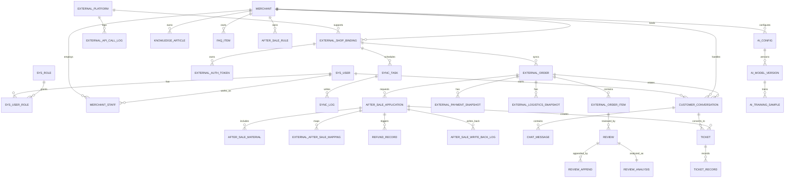

# 数据库 ER 说明

当前系统定位为抖音优先的电商售后中台。数据库关系围绕外部平台授权、订单快照、售后处理、客服工单、评价分析和 AI 能力展开。

## 核心实体关系图

## 分组说明

### 用户与权限

- `sys_user` 是统一账号表，保存消费者、商家管理员、客服和平台管理员。
- `sys_role` 定义角色：`CONSUMER`、`MERCHANT_ADMIN`、`CUSTOMER_SERVICE`、`PLATFORM_ADMIN`。
- `merchant` 是商家主体。
- `merchant_staff` 绑定商家管理员、客服和所属商家。

### 外部平台与授权

- `external_platform` 保存外部平台配置，首期平台为 `DOUYIN`。
- `external_shop_binding` 保存商家绑定的抖音店铺信息。
- `external_auth_token` 保存授权 token、过期时间和刷新信息，敏感字段需要加密。
- `external_api_call_log` 保存调用抖音接口的请求、响应、耗时和异常信息。

### 同步任务

- `sync_task` 保存订单、售后、评价等同步任务。
- `sync_log` 保存每次同步的执行结果。
- `sync_cursor` 保存增量同步游标、最后同步时间或分页标记。

### 外部订单快照

- `external_order` 保存抖音订单主信息快照。
- `external_order_item` 保存订单商品明细快照。
- `external_payment_snapshot` 保存外部支付状态快照。
- `external_logistics_snapshot` 保存外部物流状态快照。

这些数据来自外部平台，不由本系统创建交易。

### 售后与回写

- `after_sale_application` 是本系统售后申请。
- `after_sale_material` 保存用户上传的图片、说明和凭证。
- `external_after_sale_mapping` 保存本系统售后单和抖音售后单的对应关系。
- `refund_record` 保存退款状态或外部退款快照。
- `after_sale_write_back_log` 保存同意、拒绝、补充资料等回写抖音的结果。

### 客服与工单

- `customer_conversation` 保存客服会话。
- `chat_message` 保存消费者、AI 和人工客服消息。
- `quick_reply` 保存快捷回复。
- `service_evaluation` 保存客服服务评价。
- `ticket` 保存售后或咨询工单。
- `ticket_record` 保存工单处理记录。
- `operation_log` 保存后台关键操作。

### 评价与分析

- `review` 同时支持外部平台评价和本系统服务评价。
- `review_append` 保存追评。
- `review_analysis` 保存情感分析、主题归类、关键词和摘要。

### 知识库与 AI

- `knowledge_article` 保存商品售后知识、品牌口径和平台规则。
- `faq_item` 保存常见问题。
- `after_sale_rule` 保存可配置售后规则。
- `ai_config` 保存 AI 配置。
- `ai_training_sample` 保存人工标注的训练样本。
- `ai_model_version` 保存专用模型版本和评估结果。
- `ai_call_log` 保存 AI 调用日志。

## 关键业务关系

1. 一个商家可以绑定多个外部平台店铺。
2. 一个抖音店铺可以同步多个外部订单。
3. 一个外部订单可以产生多个售后申请、客服会话和评价。
4. 售后申请可以映射到抖音售后单，并将处理结果回写抖音。
5. 客服会话可以转为工单，售后申请也可以自动生成工单。
6. 评价分析结果用于差评预警、高频问题识别和经营改进。
7. AI 专用模型通过人工标注样本持续优化。
